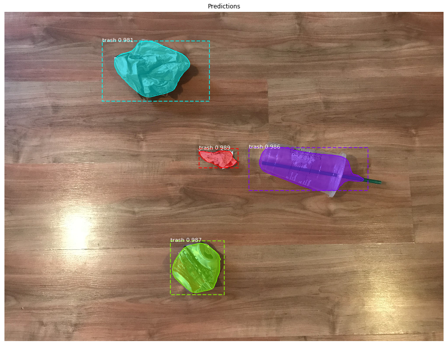
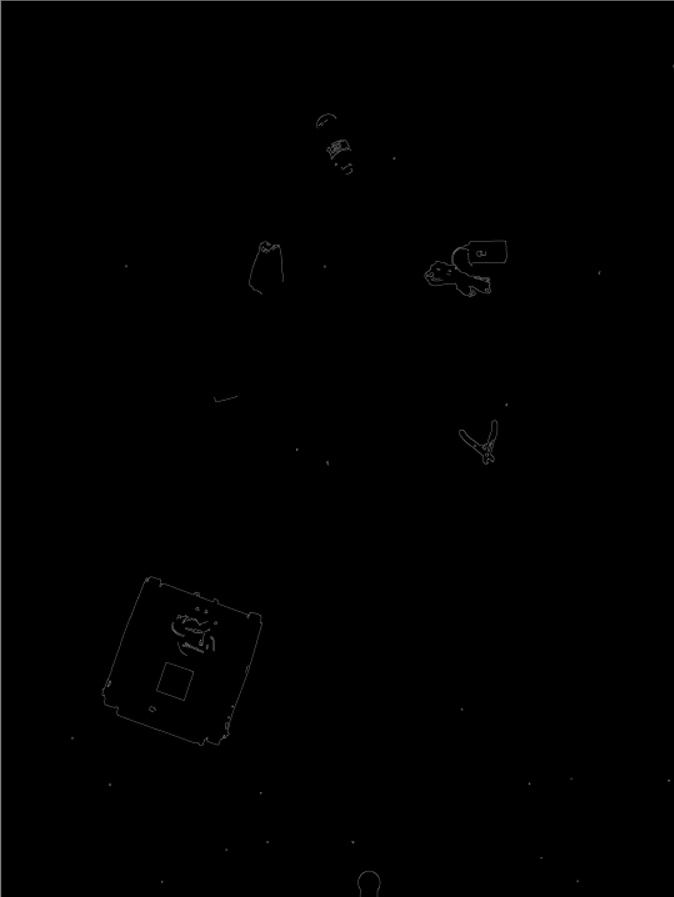
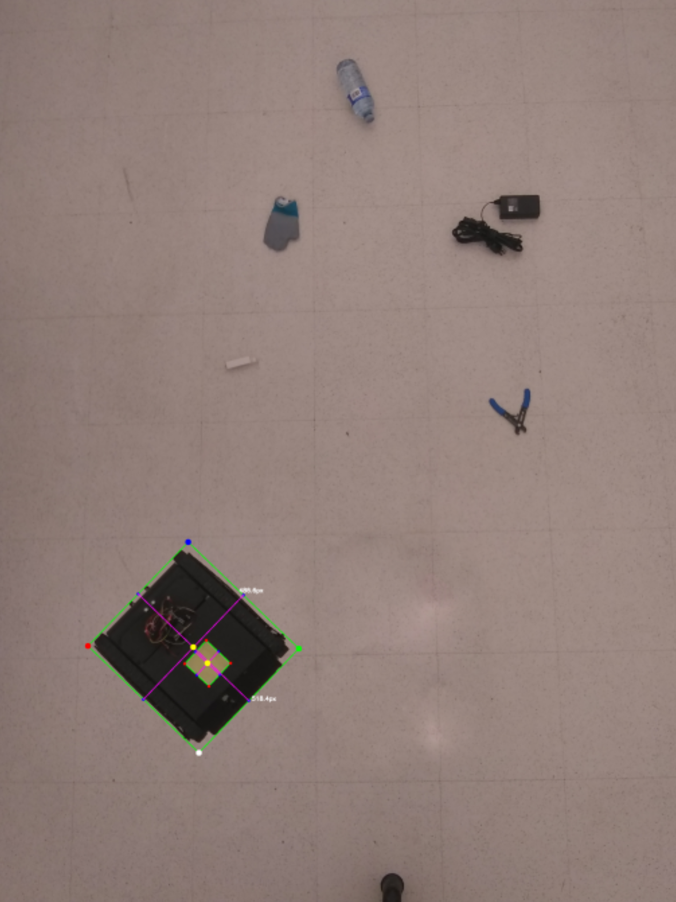
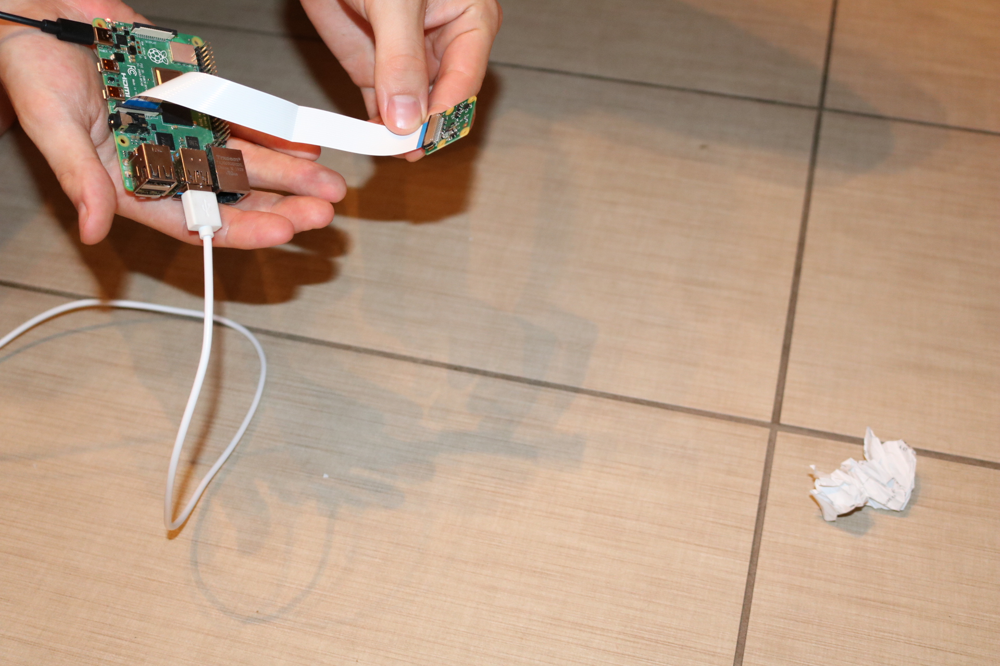
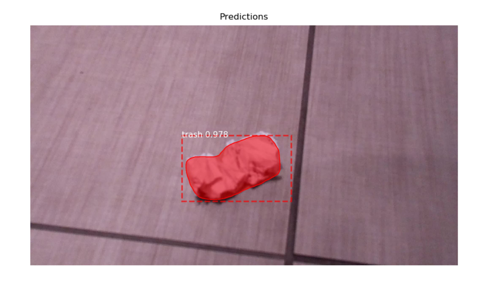

# robot-drone-collaboration
An inter-machine cooperation project using Python and C.

## Objective
The goal of this project was to have two autonomous vehicles - a land
based robot and an air based drone - cooperate together autonomously
to complete a task. The decided upon task was garbage collection.

## Approach
While we had decided on garbage collection for our specific project,
we wanted to create a system that could be generalized to any type of
autonomous collection. The proposed idea was to have a drone fly above
a given area, use video streaming to find whatever it is that needs to
be collected using image processing and a neural network trained to detect
the desired object(s), and then send commands to our land based robot to
collect it.

By separating the concerns in this way, the system can easily be adapted
to different scenarios. One example of a simple adaptation could be cleaning
up oil spills on the ocean. The land based robot could be swapped for an
amphibious vehicle and a neural network for detecting oil on top of the
water could be used.

## Hardware
* DJI Phantom 4
* Land robot:
    * Chassis consisting of tracks, servo motors, breadboard
    * IMUs
    * GPS
    * PING ultrasound sensor
    * Raspberry Pi 4
    * PiCamera v2
* Laptop

## How it Works

### Trash Detection
The model implemented to perform the trash detection was created by the Let's Do It Foundation. It's a Mask R-CNN and was
trained on imaged from Google's street view. The model performed quite well in our tests despite the difference in
perspective our images have from the training ones. 

Each object is represented as a mask which is essentially a list of pixels that are part of it. Below is an example from
our first test of the model which shows each object as well as it's respective boundary box, mask, and accuracy prediction.

More examples can be found in the notebook used to write this section: [Trash Detection](src/Trash_Detection/Detect_trash_on_images.ipynb) 

### Robot Detection
Due to time restraints and lack of available training pictures of our robot, we decided to use OpenCV and contour
detection to find our robot in the image. We grey-scaled and blurred the image slightly, performed edge detection, and
then used a combination of dilation and erosion to close gaps. Finally we used the findContours function in CV2 to create
a contour hierarchy list.

Below is an example of an image of our land vehicle and several objects that was run through this process.

We implemented a very simple and rudimentary solution of taking the largest countour area as our land vehicle. For our
testing and demonstration purposes this was enough as we always used garbage that was smaller. Please see the final note
for more information.

The system takes into account the fact that both the direction of the robot and the orientation of the aerial drone may
vary. A sticky note was added to the back of the robot which provides a simple and predictable asymmetry. Using the
midpoint of the sticky note and the midpoint of the robot we created a vector pointing in the direction the robot was
facing. We used the average angle of the sides of the robot to calculate the actual angle on a cartesian system as they
are longer and give a more accurate measurement.

### Path Planning
Path planning was also implemented with a fairly rudimentary solution with the intention on refining the actual decision
later on. Currently the system finds the closest point of each piece of garbage by transposing each items mask and running
the points through cdist(). For each object we store the closest point and then simply choose the closest object as the
next one to go to. This can be replaced or enhanced by a more advanced path planning algorithm quite easily at a later date.
The x-y coordinates representing the location of each piece of garbage are stored in the order they will be visited in a
simple list.

### Command Generation
The list of locations, as well as the starting point and orientation of the robot, are then passed to the command generation
portion of the program. Since the locations were simply pixels in the image, we required a method to turn distance between
pixels into real distances. Our solution was to use the robot as a standard measurement since we knew it would always be
in our photo and we knew the size of it. Therefore the program measures the distance between sides of the robot in the
picture and uses this to create a standard distance for a given number of pixels. It then converts all of the paths between
pieces of garbage into their real distances and calculates the number and order of turn and move forward commands the robot
requires to reach each piece.

An example of the output:

['pivot_turn_left', 'pivot_turn_left', 'move_forward', 'move_forward', 'move_forward', 'move_forward', 'move_forward', 
'move_forward', 'move_forward', 'move_forward', 'move_forward', 'halt']

### Sending commands to the robot
The neural processing was done on a laptop since the RaspberryPi was already acting as a video streaming server and the
main micro controller for our land robot. We used the MQTT protocol with Google's Google's cloud-based MQTT API in order
to relay control messages back to our RaspberryPi.

### Verification
Upon arriving at each piece of garbage the robot takes a picture of it and relays that picture back to the main laptop.
The picture is run through the trash identification neural network once more and if the system confirms that it is indeed
garbage, the robot is sent a confirmation that it can pick it up.

A demo is shown where the camera was pointed manually at a piece of litter in a manner similar to what the robot would see.
Below is the result after running the captured image through the neural network.

### Final Note
This project was started in the Fall of 2019 and was scheduled to end in the Spring of 2020. Due to COVID-19, we no longer
had access to the hardware that made up the land robot (servos + outer shell), as well as the aerial drone since, since both were property of the university.
We therefore had to finish the project through mock experiments and with limited photos that included our robot. This meant
we could not proceed with certain plans such as training a neural net to recognize the robot and instead we were forced
to complete the project with some parts in a rudimentary state, and some features ditched completely.