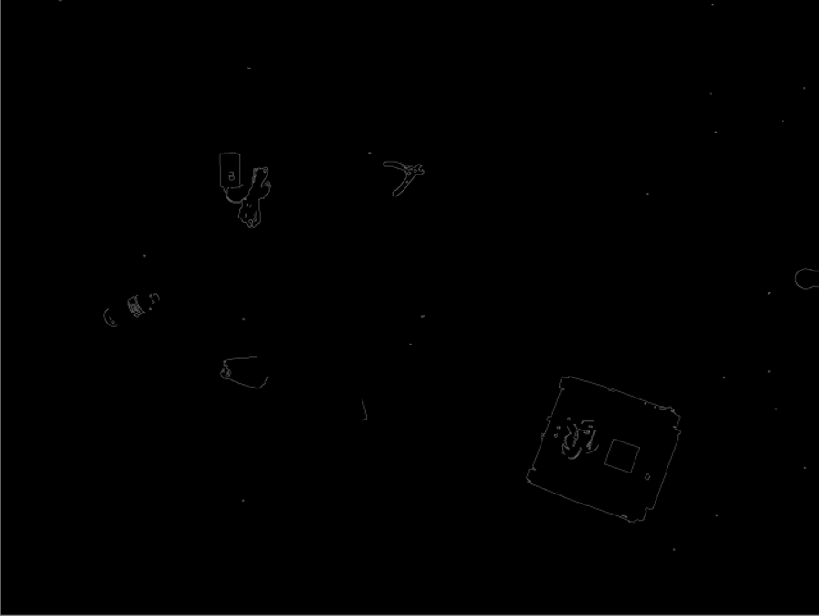

# robot-drone-collaboration
An inter-machine cooperation project using Python and C.

## Objective
The goal of this project was to have two autonomous vehicles - a land
based robot and an air based drone - cooperate together autonomously
to complete a task. The decided upon task was garbage collection.

## Approach
While we had decided on garbage collection for our specific project,
we wanted to create a system that could be generalized to any type of
autonomous collection. The proposed idea was to have a drone fly above
a given area, use video streaming to find whatever it is that needs to
be collected using image processing and a neural network trained to detect
the desired object(s), and then send commands to our land based robot to
collect it.

By separating the concerns in this way, the system can easily be adapted
to different scenarios. One example of a simple adaptation could be cleaning
up oil spills on the ocean. The land based robot could be swapped for an
amphibious vehicle and a neural network for detecting oil on top of the
water could be used.

## Hardware
* DJI Phantom 4
* Land robot:
    * Chassis consisting of tracks, servo motors, breadboard
    * IMUs
    * GPS
    * PING ultrasound sensor
    * Raspberry Pi 4
    * PiCamera v2
* Laptop

## How it Works

### Trash Detection
The model implemented to perform the trash detection was created by the Let's Do It Foundation. It's a Mask R-CNN and was
trained on imaged from Google's street view. The model performed quite well in our tests despite the difference in
perspective our images have from the training ones. 

Each object is represented as a mask which is essentially a list of pixels that are part of it. Below is an example from
our first test of the model which shows each object as well as it's respective boundary box, mask, and accuracy prediction.

[Prediction Results](docs/image_masks.png "Prediction Results")

More examples can be found in the notebook used to write this section:  

### Robot Detection
Due to time restraints and lack of available training pictures of our robot, we decided to use OpenCV and contour
detection to find our robot in the image. We grey-scaled and blurred the image slightly, performed edge detection, and
finally used a combination of dilation and erosion to close gaps. We then used the findContours function in CV2 to create
a contour hierarchy list.

Below is an example of an image of our land vehicle and several objects that was run through this process.

We implemented a very simple and rudimentary solution of taking the largest countour area as our land vehicle. For our
testing and demonstration purposes this was enough as we always used garbage that was smaller. Please see the final note
for more information.

The system takes into account the fact that both the direction of the robot and the orientation of the aerial drone may
vary. A sticky note was added to the back of the robot which provides a simple and predictable asymmetry. Using the
midpoint of the sticky note and the midpoint of the robot we created a vector pointing in the direction the robot was
facing. We used the average angle of the sides of the robot to calculate the actual angle on a cartesian system as they
are longer and give a more accurate measurement.

